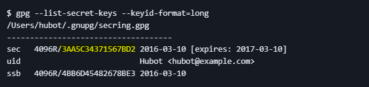

# PGP Signing

## Requirements

* [GNU GPG in Windows](https://www.gpg4win.org/get-gpg4win.html) (included in the [winget](https://git.jfalava.eu/jfalava/winget-script/src/branch/main/winget-script.ps1) script)
* `brew install gnupg` and [GPG Suite](https://gpgtools.org/) and in macOS

## Generate and/or add a PGP key

1. Generate a new PGP key:  

    ```zsh
    gpg --full-generate-key
    ```

2. Or Import an existing pair of PGP keys (public and private):  

    ```zsh
    gpg --import <filename>
    ```

## Add it to Git

1. (Windows only) Set the path to the GPG executable that Git Bash should use:

    ```bash
    git config --global gpg.program "C:/Program Files (x86)/GnuPG/bin/gpg.exe"
    ```

1. In `Git Bash`, your OS terminal or `VSCode` terminal, enter the following command, replacing `example@example.com` with the email address associated with the key you want to use:

    ```bash
    git config --global user.signingkey example@example.com
    ```

    > This will tell `git` to search and use a private key with that email.

1. You can also use the 8-bit fingerprint instead of the email:

    ```bash
    gpg --list-secret-keys --keyid-format=LONG
    ```

    > Example:  
    

    ```bash
    git config --global user.signingkey <key-id>
    ```

1. Run the command to enable GPG signing for Git commits:

    ```zsh
    git config --global commit.gpgsign true
    ```

## Annex: test the signing

[Bash script](https://git.jfalava.eu/jfalava/git-documentation/src/branch/main/manuals/resources/gpg-sign-test.sh) for testing.  

This script fetches the default GPG key using the `gpg` command and configures Git to use it for signing commits with the `git config` command. The `--global` option specifies that the configuration should apply globally to all repositories on the system. The command `git config --global commit.gpgsign true` enables GPG signing for all commits made in the future.

The script then creates a new Git repository in the current directory using `mkdir` and `git init`. It adds a file named `myfile.txt` to the Git index using `echo` and `git add`, which tracks changes to be committed.  

A new commit is created with a message using `git commit`. The `-S` option specifies that the commit should be signed, and the `-m` option specifies the commit message.

Finally, the script verifies the signed commit using the `git log` command with the `--show-signature` option. This command displays the Git commit history, including information about any GPG signatures attached to each commit.

## Annex: export PGP keys

Open the Terminal:

1. Type the following command to list your keys:  

   ```zsh
    gpg --list-keys
   ```

2. To export the public key, type the following command, replacing `<key-id>` with the ID of your key pair:

    ```zsh
    gpg --export -a <key-id> > public_key.asc
    ```  

    This command will export your public key to a file named `public_key.asc` in your current directory.

3. To export the private key, type the following command, replacing `<key-id>` with the ID of your key pair:

   ```zsh
    gpg --export-secret-key -a <key-id> private_key.asc
   ```
